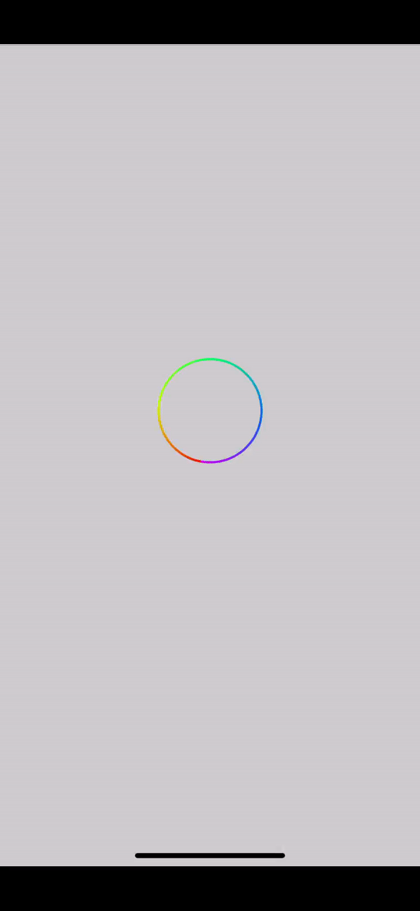
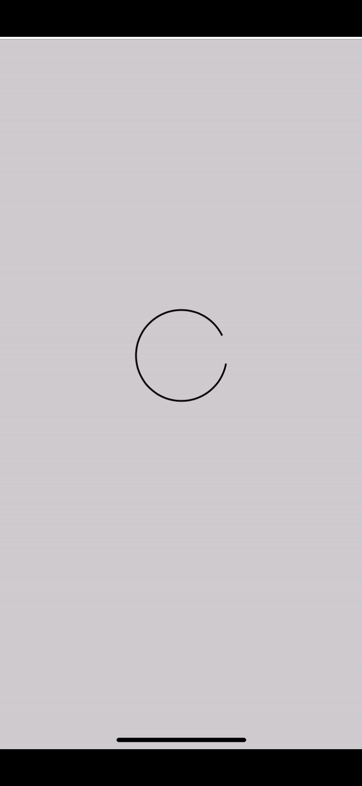

# DSProgressHud

ProgressHud to show indeterminent progress to download or upload any task.

# Gradient Progress



# Simple Progress



# Usage Sample

- There are two types of Hud `DSProgressHud` and `DSGradientProgressHud`

- You need import progressHud `import ProgressHud`
- To show `DSProgressHud`

```swift
DSProgressHud.showhud(to: self.view)
```

To hide `DSProgressHud` 

```swift
DSProgressHud.hideHud(for: self.view)
```
OR

```swift
DSProgressHud.hideAllHud(to: self.view)
```

To show `DSGradientProgressHud`

```swift
DSGradientProgressHud.showhud(to: self.view)
```

To hide `DSGradientProgressHud`

```swift
DSGradientProgressHud.hideHud(for: self.view)
```

OR

```swift
DSGradientProgressHud.hideAllHud(for: self.view)
```
